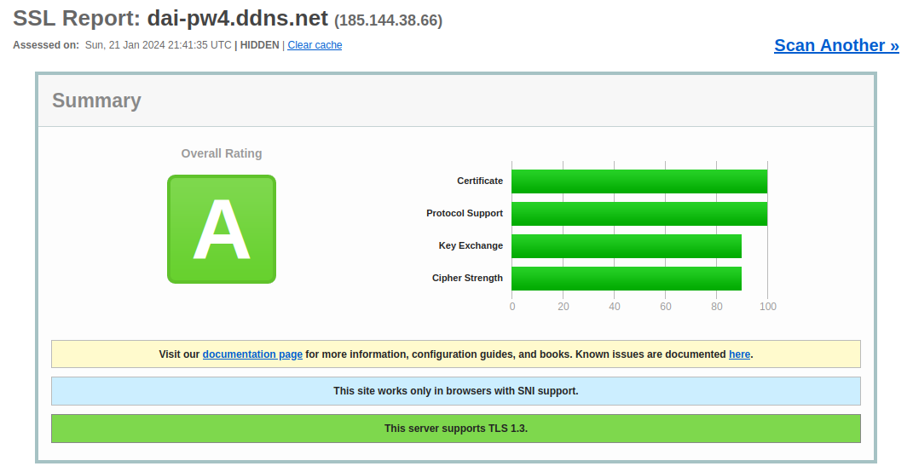

# DAI-PW4 - Drink Manager

The Drink Manager API is a web service designed for managing a database of drinks. It operates on HTTP port 8080. This API follows the CRUD (Create, Read, Update, Delete) pattern, offering endpoints to create, retrieve, update, or delete drinks. You can also place an order. This tool is particularly useful if you need to manage a dynamic drink inventory and order as you would in a bar or restaurant.

So as not to pollute the readme, the API interaction are in the [API](docs/API.md) section, you can also see command used to deploy the server in the [Server configuration](docs/serverConfig.md) section and you also find how to configure DNS zone in [DNS](docs/DNS.md) section.


## Deployment

Package the application or use Package as JAR in your IDE

```cmd
./mvnw clean package
```

Create a docker image
```cmd
docker build -t dai-pw4 .
```

Create a docker multistage image

```cmd
docker build -t dai-pw4 -f multistage.Dockerfile .
```


## Build and publish the web application with Docker

Build docker image
```cmd
docker build -t dai-pw4 .
```

Tagging the Image
```cmd
docker tag dai-pw4 docker pull ghcr.io/apirakas/dai-pw4
```

Publish the image on GitHub Container Registry

```cmd
docker push ghcr.io/apirakas/dai-pw4
```

Run docker image

```cmd
docker run --rm -it dai-pw4
```

Pull image from github directory
```cmd
docker pull ghcr.io/apirakas/dai-pw4:latest
```


## Usage

### Drinks endpoint

To **create** a drink

```json
curl -i -X POST -H "Content-Type: application/json" -d 
    "{
    \"name\":\"Sprite\", 
    \"price\":\"3.60\"
    }" 
    https://localhost/drinks
```

To **update** a drink by its id
```json
curl -i -X PUT -H "Content-Type: application/json" -d 
    "{
    \"name\":\"Coca\", 
    \"price\":\"3.60\"
    }" 
    https://localhost/drinks/{id}
```

To **delete** a drink by its id
```cmf
curl -i -X DELETE https://localhost/drinks/{id}
```

To **get** all the drinks you can access 
```cmf
https://localhost/drinks 
```
or
```cmd
curl https://localhost/drinks
```

To **get drink by its id** you can access

```html
https://localhost/drinks/{id}
```
or
```cmd
curl https://localhost/drinks/{id}
```


## Group composition and roles for each member

|                     Members                      | Code | Documentation | Infrastructure | Communication | Test | Presentation |
| :----------------------------------------------: | :--: | :-----------: | :------------: | :-----------: | :--: | :----------: |
|   [@apirakas](https://www.github.com/apirakas)   |      |       x       |       x        |               |      |      x       |
| [@HumairRomain](https://github.com/HumairRomain) |  x   |               |                |               |  x   |      x       |
| [@lucaslattion](https://github.com/lucaslattion) |      |               |                |       x       |  x   |      x       |
|    [@Lyrafll](https://www.github.com/Lyrafll)    |  x   |       x       |                |               |      |      x       |


## Little extra
It's not required, but it's always better not to have a vulnerable program, especially if it can be accessed by anyone.

We noticed that javalin had a vulnerability with version 5.6.3 due to a depandancy (CVE-2023-6378), so we're using version 6.0.0 in beta 4.

When we launch a site in https, it's a good idea to check that our server's configuration (which versions of tls, cipher suites, handshake, etc.) is correct. To get a quick answer, we can run a check with the following site [Qualys](https://www.ssllabs.com/ssltest/). 



