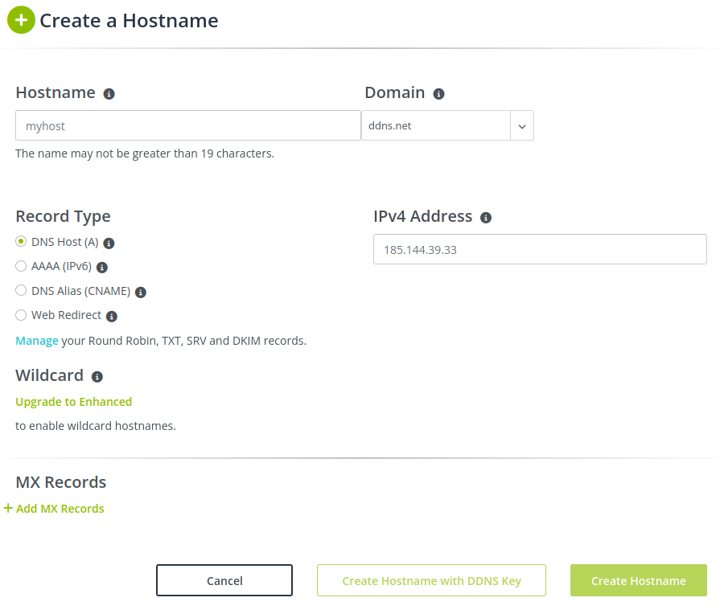

# Drink Manager - Domain Name Server

Hostname: IICT-MV366-DAI
DNS:  dai-pw4.ddns.net
IP interne : 10.190.132.66
IP externe : 185.144.38.66

Create an account on this website https://my.noip.com/

We will create a subdomain on this website configure it as you like. Here's some information to complete it.

**Hostname**

For the host name, you can use whatever you like. As we're going to use this name as a subdomain, there's nothing to worry about. But avoid to copy the name of an existing site. Some sites don't like this because of malicious sites (e.g. phishing).

**Domain**

We can select among the domains proposed by the site. We can select from the domains offered by the site. If we want to have our own domain with a better known extension. We'll have to pay for it.

**Record Type**

Select the DNS Host (A) as Record Type this will create the name to point to the external IP of our virtual machine.

**IPv4 Address**

To view your site from anywhere you need to configure your public ip address.

Then we can click on Create Hostname

Check if everything work:

- Wait a few minutes for the DNS propagation to complete (between 10-15 minutes).
- Validate you can ping your virtual machine using the domain name. 
- Validate the DNS records are fine using the `nslookup`/`dig` commands. 